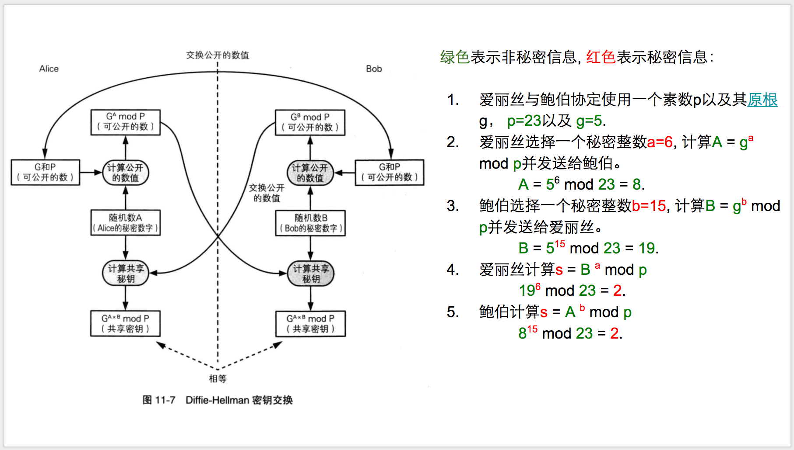

# End-to-End Encryption, Secret Chats

> https://core.telegram.org/api/end-to-end


## Key Generation

Keys are generated using the `Diffie-Hellman protocol`.

- 一种基于离散对数问题的安全协议；
  - A=g^a (mod p)
  - 已知g、a、p，求A容易
  - 已知A、g、p，求a很难
- 让通信双方在完全没有对方任何预先信息的条件下，通过不安全信道安全地交换数据，并最终生成一个同样的密钥。



Scenario: User `A` would like to initiate encrypted communication with User `B`.

### Sending a Request

- User `A`: executes `messages.getDhConfig` to obtain the Diffie-Hellman parameters: a prime `p`, and a high order element `g`.
  - 检查`p`是否是一个安全的2048-bit素数
    - both p and (p-1)/2 are prime
    - 2^2047 < p < 2^2048
  - 完成对`g`和`p`的检查后，`client`会将结果进行缓存；
    - 避免以后重复进行冗长的计算；
    - 此处的缓存可能会与Authorization Key generation共享。

***
messages.getDhConfig

Returns configuration parameters for Diffie–Hellman key generation. Can also return a random sequence of bytes of required length.

```TL
messages.dhConfigNotModified#c0e24635 random:bytes = messages.DhConfig;
messages.dhConfig#2c221edd g:int p:bytes version:int random:bytes = messages.DhConfig;
---functions---
messages.getDhConfig#26cf8950 version:int random_length:int = messages.DhConfig;
```

> https://core.telegram.org/method/messages.getDhConfig

***

### Accepting a Request


### Perfect Forward Secrecy

重新生成密钥`key`

- `key`已经被用于加解密超过100条消息；
- `key`已经被使用（至少加密过1条消息）超过1周；

## Sending and Receiving Messages in a Secret Chat

### Serialization and Encryption of Outgoing Messages

在`MTProto 2.0`中, AES的密钥`aes_key`以及初始化向量`aes_iv`通过下列方式计算产生：

- `msg_key_large = SHA256 (substr (key, 88+x, 32) + plaintext + random_padding)`；
- `msg_key = substr (msg_key_large, 8, 16)`;
- `sha256_a = SHA256 (msg_key + substr (key, x, 36))`;
- `sha256_b = SHA256 (substr (key, 40+x, 36) + msg_key)`;
- `aes_key = substr (sha256_a, 0, 8) + substr (sha256_b, 8, 16) + substr (sha256_a, 24, 8)`;
- `aes_iv = substr (sha256_b, 0, 8) + substr (sha256_a, 8, 16) + substr (sha256_b, 24, 8)`;

其中，`key`是双方的共享密钥，在`Key Generation`过程中得到。

此外，在`MTProto 2.0`中, 秘密聊天发起方的`x=0`，秘密聊天的另一方`x=8`。

数据使用`AES-256`加密算法在`infinite garble extension (IGE)`模式下进行加密。

***

**Where is AES IGE used?**

Is only used by Telegram. Telegram greatly simplified the exchange by requiring three roundtrips, using RSA, AES-IGE (some weird mode that nobody uses), and Diffie-Hellman, along with a proof of work (the client has to factor a number, probably a DoS protection). 

Also, they employ some home made function to generate the AES key and IV from nonces generated by the server and the client (server_nonce appears in plaintext during the communication).

$$y_{i} = f_{k}(x_{i}\oplus y_{i-1})\oplus x_{i-1}$$

> https://mgp25.com/AESIGE/

This mode was based on a mode developed by Carl Campbell, called Infinite Garble Extension (IGE) mode.

In IGE mode, the plaintext is XORed, before encryption, with the previous ciphertext; after going through the block cipher, it is XORed with the previous plaintext:

```
 Plaintext
        |-------------           |
        |             |          |
   --->XOR        ------------->XOR
        |         |   |          |
   -----------    |   |     -----------
   |   AES   |    |   |     |   AES   |
   -----------    |   |     -----------
        |         |   |          |
   --->XOR        |    -------->XOR
        |         |              |
        |---------               |-----
        |                        |
        |                        |
 Ciphertext
```

***

### Sending Encrypted Files

All files sent to secret chats are encrypted with one-time keys that are in no way related to the chat’s shared key. 

***
messages.sendEncryptedFile

Sends a message with a file attachment to a secret chat

```TL
messages.sentEncryptedMessage#560f8935 date:int = messages.SentEncryptedMessage;
messages.sentEncryptedFile#9493ff32 date:int file:EncryptedFile = messages.SentEncryptedMessage;
---functions---
messages.sendEncryptedFile#9a901b66 peer:InputEncryptedChat random_id:long data:bytes file:InputEncryptedFile = messages.SentEncryptedMessage;
```

> https://core.telegram.org/method/messages.sendEncryptedFile

***

一次一密（One-Time Pad)

- 无条件安全的密码（香农）
- 绝对安全性的条件
  - 密钥必须是完全随机的（不可预测、不可复现）
  - 密钥必须与明文等长
  - 密钥只能使用一次

***

