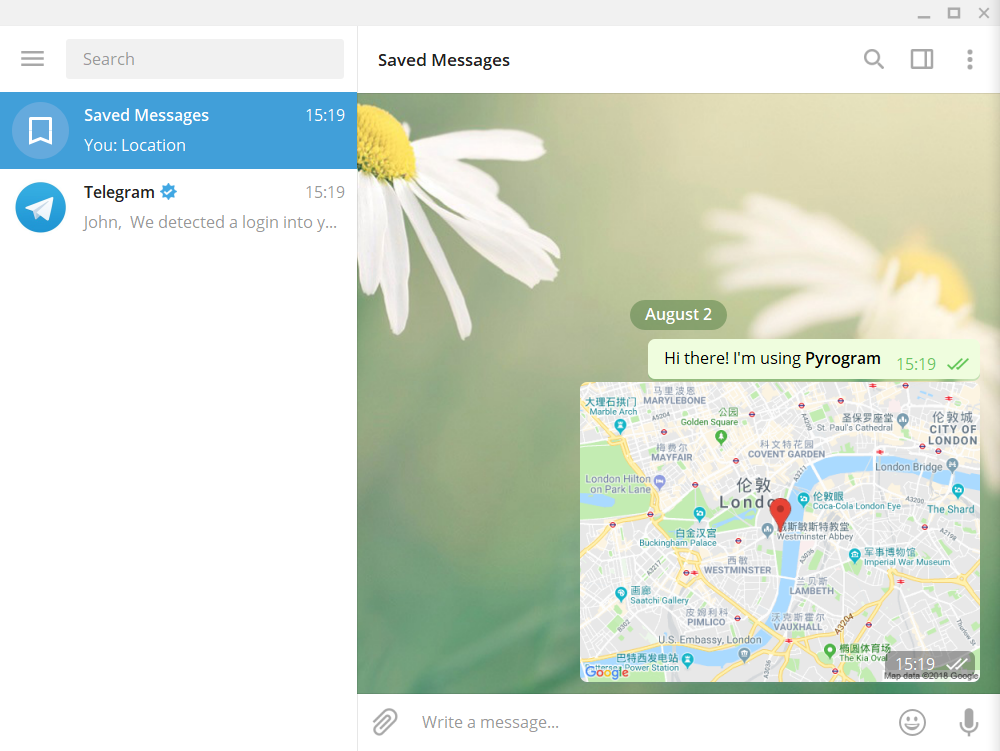
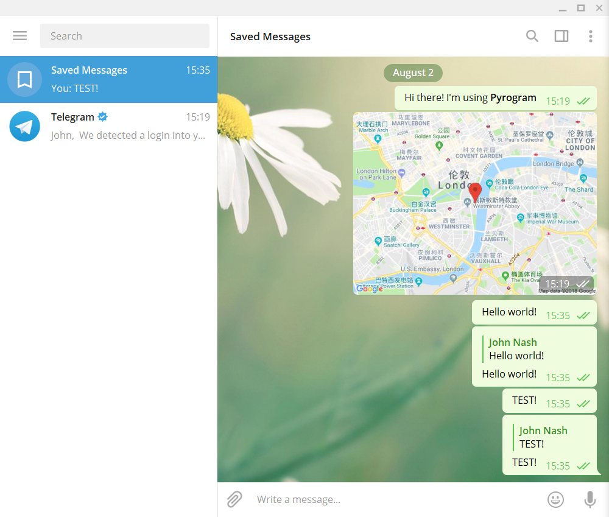

# Telegram MTProto API Client Library for Python 

> https://docs.pyrogram.ml/

> https://github.com/pyrogram/pyrogram

## Hello World

Demonstration of basic API usages.

```python
#!/usr/bin/env python3
# -*- coding: utf-8 -*-

# Pyrogram - Telegram MTProto API Client Library for Python
# Copyright (C) 2017-2018 Dan Tès <https://github.com/delivrance>
#
# This file is part of Pyrogram.
#
# Pyrogram is free software: you can redistribute it and/or modify
# it under the terms of the GNU Lesser General Public License as published
# by the Free Software Foundation, either version 3 of the License, or
# (at your option) any later version.
#
# Pyrogram is distributed in the hope that it will be useful,
# but WITHOUT ANY WARRANTY; without even the implied warranty of
# MERCHANTABILITY or FITNESS FOR A PARTICULAR PURPOSE.  See the
# GNU Lesser General Public License for more details.
#
# You should have received a copy of the GNU Lesser General Public License
# along with Pyrogram.  If not, see <http://www.gnu.org/licenses/>.

from pyrogram import Client

"""This example demonstrates a basic API usage"""

# Create a new Client instance
app = Client("my_account")

# Start the Client before calling any API method
app.start()

# Send a message to yourself, Markdown is enabled by default
app.send_message("me", "Hi there! I'm using **Pyrogram**")

# Send a location to yourself
app.send_location("me", 51.500729, -0.124583)

# Stop the client when you're done
app.stop()
```



## Echo bot

Echo bot that replies to every private text message.

```Python
# Pyrogram - Telegram MTProto API Client Library for Python
# Copyright (C) 2017-2018 Dan Tès <https://github.com/delivrance>
#
# This file is part of Pyrogram.
#
# Pyrogram is free software: you can redistribute it and/or modify
# it under the terms of the GNU Lesser General Public License as published
# by the Free Software Foundation, either version 3 of the License, or
# (at your option) any later version.
#
# Pyrogram is distributed in the hope that it will be useful,
# but WITHOUT ANY WARRANTY; without even the implied warranty of
# MERCHANTABILITY or FITNESS FOR A PARTICULAR PURPOSE.  See the
# GNU Lesser General Public License for more details.
#
# You should have received a copy of the GNU Lesser General Public License
# along with Pyrogram.  If not, see <http://www.gnu.org/licenses/>.

from pyrogram import Client, Filters

"""This simple echo bot replies to every private text message.
It uses the @on_message decorator to register a MessageHandler
and applies two filters on it, Filters.text and Filters.private to make
sure it will only reply to private text messages.
"""

app = Client("my_account")


@app.on_message(Filters.text & Filters.private)
def echo(client, message):
    client.send_message(
        message.chat.id, message.text,
        reply_to_message_id=message.message_id
    )


app.run()  # Automatically start() and idle()

```
