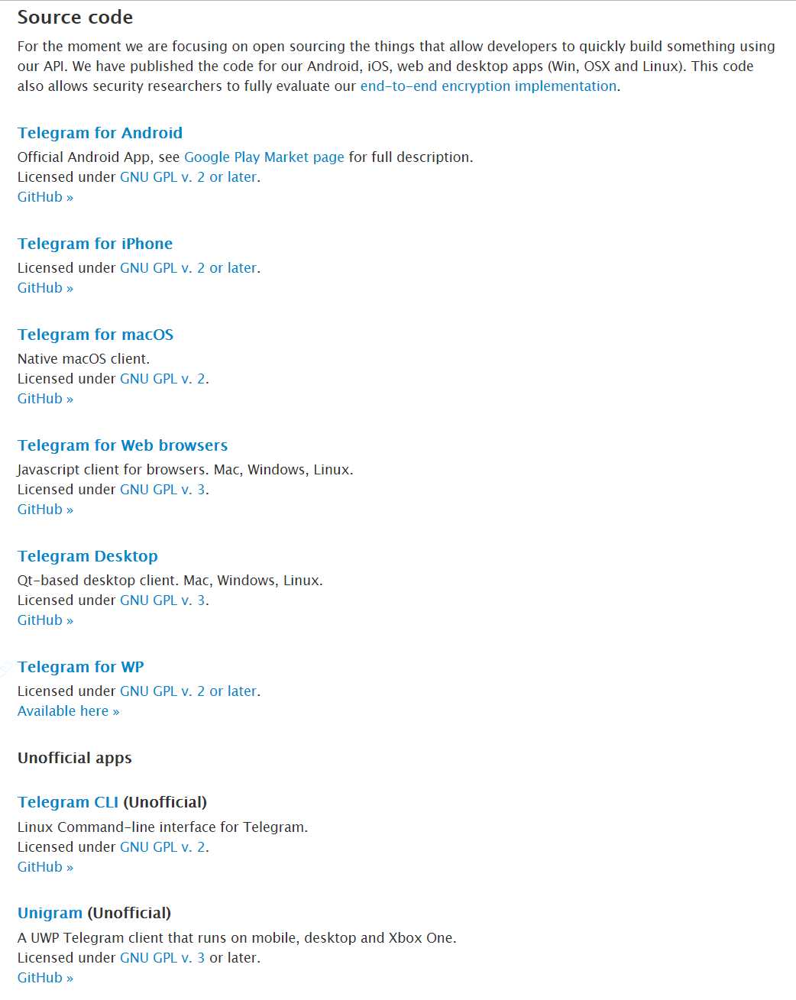

# Telegram Source Code

> https://telegram.org/apps#source-code

`Telegram`目前已经对Android、iOS、web以及desktop apps(Win, OSX and Linux)进行了开源。

## Telegram Desktop

> https://github.com/telegramdesktop/tdesktop

- Qt-based desktop client
- Mac, Windows, Linux
- Languages: `C++`
- `MTProto`协议基于`C++`实现

## Telegram for Android

> https://github.com/DrKLO/Telegram

- Official Android App
- Languages: `JAVA`, `C++`
- `MTProto`协议基于`C++`实现

## Telegram for iPhone

> https://github.com/peter-iakovlev/Telegram

- Telegram Messenger for iOS
- Languages: `Objective-C`, `Objective-C++`
- `MTProto`协议基于`Objective-C`(MtProtoKit)实现

## Telegram for macOS

> https://github.com/overtake/TelegramSwift

- Native macOS client.
- Languages: `Swift`, `Objective-C`
- `MTProto`协议基于`Objective-C`(MtProtoKit)实现

## MtProtoKit

> https://github.com/peter-iakovlev/MtProtoKit

- Universal MTProto framework for both iOS and OS X
- Languages: `Objective-C`

## Telegram for Web browsers

> https://github.com/zhukov/webogram

- Javascript client for browsers. Mac, Windows, Linux.
- Languages: `Javascript`, `C++`
- `MTProto`协议基于`C++`实现

