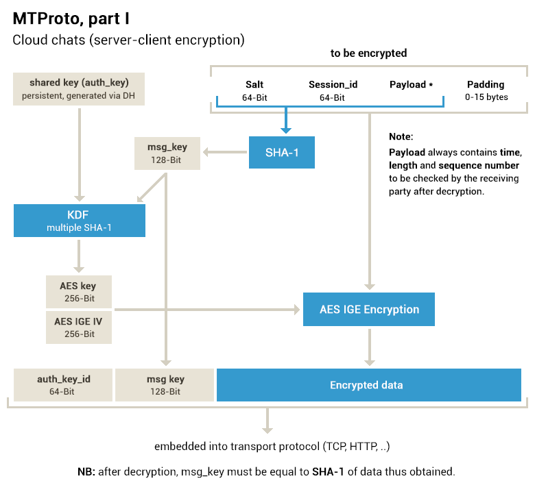

# MTProto Mobile Protocol

> 原文地址：https://core.telegram.org/mtproto

## 概述

### 目的

`MTProto`协议被运行在移动设备上的应用程序（不包括浏览器）用于访问服务器`API`。

### 协议划分

- High-level component：通过将API的查询与响应转换为二进制消息定义了相应的方法。
- Cryptographic layer：通过被优先加密并放入传输层协议的消息定义相应的方法。
- Transport component：为客户端与服务器通过现有的网络协议（如HTTP、HTTPS、TCP、UDP）传输消息定义了方法。

`MTProto`协议分为`v.1.0`和`v.2.0`两个版本，`v.1.0`正在被逐步弃用，其主要差异为：

- 使用`SHA-256`取代了`SHA-1`；
- 计算`msg_key`时，哈希函数的输入中加入了用于填充的字节（padding bytes）；
- `msg_key`不再仅取决于被加密的消息，还与`ayth_key`有关；
- `padding`的长度由`0-15 bytes`增加到了`12-1024 bytes`。

## 组件简介

### High-level componen (RPC Query Language/API)

### Authorization and Encryption

### Transport