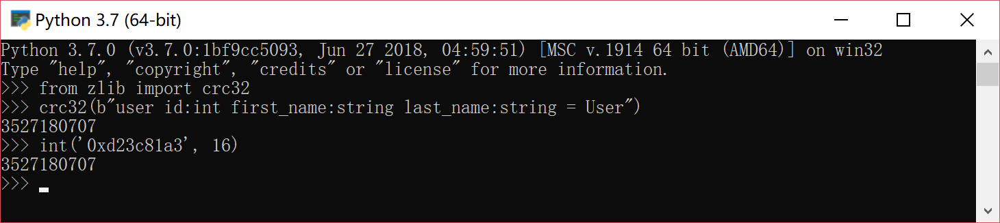
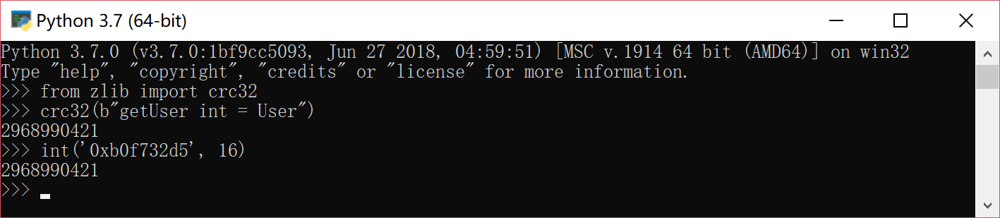

# TL Language

> https://core.telegram.org/mtproto/TL

`Type Language`是`Telegram`用来描述`MTProto`的一种自定义语言

- 仅起到协议的描述作用；
- 最终通信需要序列化为二进制流；

## Overview

一个`TL`程序包含**类型定义区**与**方法定义区**两部分，由关键词`---functions---`进行分隔;如果需要在方法定义区的后面定义额外的数据类型，需要使用关键词`--- types ---`进行分割。

- 类型定义区
- `---functions---`
- 方法定义区
- `---types---`
- 额外类型区

## Namespaces

## Comments

Comments are the same as in C++.

## Example

### the declared type

声明格式：构造函数 = 具体类型

```TL
user#d23c81a3 id:int first_name:string last_name:string = User;
```

- `User`为定义的数据类型；
- `user`为构造方法名；
- `#d23c81a3`为构造方法的全局唯一标识符；
- `id:int first_name:string last_name:string`为构造方法的参数；

在一般的编程语言中，方法对应内存中的某个地址；在跨网络通信中，通过传递唯一标识符，可以快速识别、调用另外一台机器上的某个方法。

- 在默认情况下，`Telegram`使用`CRC32`算法计算方法的全局唯一标识符。
- `CRC32("user id:int first_name:string last_name:string = User") = #d23c81a3`。



### the declared functions

声明格式：方法签名 = 返回值类型

```TL
getUser#b0f732d5 int = User;
```

- `getUser`为方法名；
- `#b0f732d5`为方法的全局唯一标识符；
- `int`为方法参数；
- `User`为方法返回值类型；



### Example of an RPC query

Suppose we want to call getUsers([2,3,4]). 

```TL
// API functions (aka RPC functions)
getUser#b0f732d5 int = User;
getUsers#2d84d5f5 (Vector int) = Vector User;
```

```TL
vector

A universal vector constructor.

vector#1cb5c415 {t:Type} # [ t ] = Vector t;
```

> https://core.telegram.org/constructor/vector

This query will be serialized into a sequence of 32-bit integers as follows:

```TL
0x2d84d5f5 0x1cb5c415 0x3 0x2 0x3 0x4
```

Please note that TL serialization yields sequences of 32-bit integers. When it has to be embedded into a byte stream, for example a network packet, each 32-bit integer is represented by four bytes in little-endian order. In this way the above query corresponds to the following byte stream:

```TL
F5 D5 84 2D 15 C4 B5 1C 03 00 00 00 02 00 00 00 03 00 00 00 04 00 00 00
```

The response might look something like this:

```TL
0x1cb5c415 0x3 0xd23c81a3 0x2 0x74655005 0x00007265 0x72615006 0x72656b 0xc67599d1 0x3 0xd23c81a3 0x4 0x686f4a04 0x6e 0x656f4403
```

This roughly corresponds to

```Json
[
    {
        "id":2,
        "first_name":"Peter",
        "last_name":"Parker"
    },
    {},
    {
        "id":4,
        "first_name":"John",
        "last_name":"Doe"
    }
]
```

Note that in both cases the same universal constructor `vector#1cb5c415` is used: in the request to serialize the value of type `Vector int`, and in the serialization of the value of type `Vector User` in the response.

There is no ambiguity because in both cases the type of the value being (de)serialized is known before its (de)serialization begins. 

For example, after receiving the query, the server sees that the first part is `0x2d84d5f5`, which corresponds to the combinator `getUsers#2d84d5f5 (Vector int) = Vector User`. Thus, it is understood that what follows will be a value of type Vector int. After receiving the response to this query, the client knows that it must receive a value of type `Vector User` and it deserializes the response accordingly.